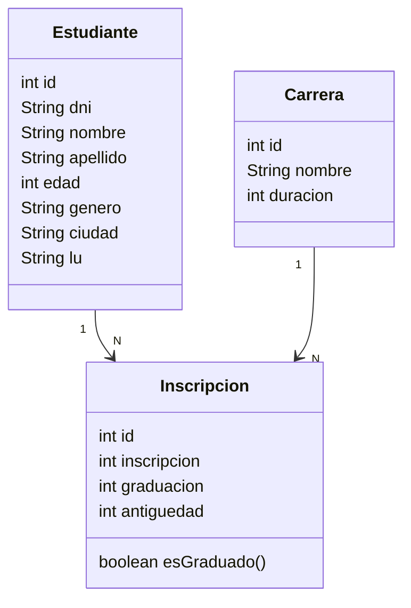
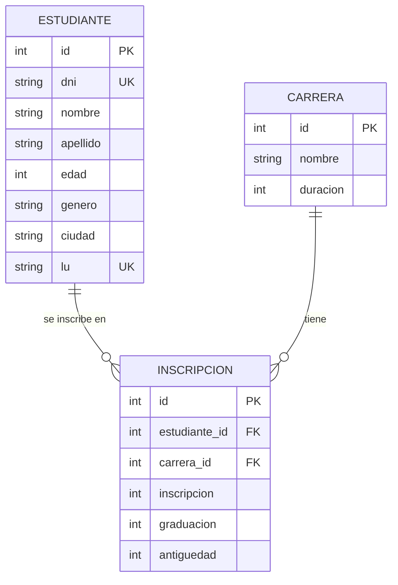

# Plan: Registro de Estudiantes (Integrador 2)

Documento de planificación y diseño de la solución al enunciado del
**Ejercicio Integrador** sobre un registro de estudiantes. Contiene el
modelo de datos, las decisiones de diseño, el mapeo JPA, el detalle de
cada consulta en JPQL y la estrategia de carga desde los archivos `.csv`.

> Estado: **plan aprobado** (rondas de diseño cerradas). La implementación
> queda para una sesión posterior con su propio OK.

---

## 1. Enunciado

1. Diseñar el **diagrama de objetos** y el **diagrama DER** para un registro
   de estudiantes: `nombres`, `apellido`, `edad`, `género`, `número de
   documento`, `ciudad de residencia`, `número de libreta universitaria`,
   `carrera(s)` en las que está inscripto, `antigüedad` en cada carrera y
   `si se graduó o no`.
2. Implementar consultas para:
   - **a)** dar de alta un estudiante
   - **b)** matricular un estudiante en una carrera
   - **c)** recuperar todos los estudiantes con un criterio de ordenamiento simple
   - **d)** recuperar un estudiante por su número de libreta universitaria
   - **e)** recuperar todos los estudiantes por género
   - **f)** recuperar las carreras con estudiantes inscriptos, ordenadas por cantidad de inscriptos
   - **g)** recuperar los estudiantes de una determinada carrera, filtrado por ciudad de residencia
3. Generar un **reporte** de las carreras con inscriptos y egresados por año,
   ordenadas alfabéticamente y con años cronológicos.

**Nota:** las consultas deben resolverse mayormente en **JPQL**, no en código Java.

---

## 2. Stack y estructura del proyecto

| Decisión | Valor |
|---|---|
| Proyecto nuevo | `estudiantesJPA/` (a la par de `bibliotecaJPA/`, que queda intacto como referencia) |
| Lenguaje / JDK | **Java 25** |
| Build | Maven |
| Persistencia | Jakarta JPA 3.1 + Hibernate 6.4.x sobre MySQL 8 |
| Datos | Archivos `.csv` cargados con **opencsv** |
| Herramientas | Lombok |

Estructura prevista:

```
estudiantesJPA/
├── pom.xml
├── src/main/resources/
│   ├── META-INF/persistence.xml
│   └── datos/
│       ├── estudiantes.csv
│       ├── carreras.csv
│       └── estudianteCarrera.csv
└── src/main/java/estudiantes/
    ├── Main.java
    ├── factory/JPAUtil.java
    ├── modelo/Estudiante.java
    ├── modelo/Carrera.java
    ├── modelo/Inscripcion.java
    ├── repository/EstudianteRepository.java / EstudianteRepositoryImpl.java
    ├── repository/CarreraRepository.java / CarreraRepositoryImpl.java
    ├── repository/InscripcionRepository.java / InscripcionRepositoryImpl.java
    └── dto/
        ├── CarreraCantidadDTO.java
        ├── BusquedaEstudianteDTO.java
        └── ReporteCarreraDTO.java
```

**Nota de versión Java:** el `pom.xml` debe declarar `maven.compiler.source` y
`maven.compiler.target` en **25** (en la referencia de bibliotecaJPA estaban
en 21, hay que ajustarlos).

---

## 3. Modelo de dominio

Tres entidades. La relación `Estudiante`–`Carrera` es **N:M con atributos**
propios de la relación (`inscripcion`, `graduacion`, `antiguedad`), por lo que
se modela como una **entidad asociativa** `Inscripcion`.

### 3.1 `Estudiante`

| Atributo | Tipo | Notas |
|---|---|---|
| `id` | `int` | PK autogenerada (`IDENTITY`) |
| `dni` | `String` | `unique` (columna única). En el CSV es número, se modela como String para ser robusto |
| `nombre` | `String` | |
| `apellido` | `String` | |
| `edad` | `int` | |
| `genero` | `String` | Libre (tolerante a categorías variadas), normalizado en carga |
| `ciudad` | `String` | |
| `lu` | `String` | Número de libreta universitaria, `unique` e indexado (consulta d) |
| `inscripciones` | `List<Inscripcion>` | `@OneToMany(mappedBy = "estudiante")`, LAZY |

### 3.2 `Carrera`

| Atributo | Tipo | Notas |
|---|---|---|
| `id` | `int` | PK autogenerada |
| `nombre` | `String` | |
| `duracion` | `int` | En años |
| `inscripciones` | `List<Inscripcion>` | `@OneToMany(mappedBy = "carrera")`, LAZY |

### 3.3 `Inscripcion` (entidad asociativa)

| Atributo | Tipo | Notas |
|---|---|---|
| `id` | `int` | PK autogenerada |
| `estudiante` | `Estudiante` | `@ManyToOne` |
| `carrera` | `Carrera` | `@ManyToOne` |
| `inscripcion` | `int` | Año de inscripción |
| `graduacion` | `int` | Año de graduación; **`0` = no graduado** |
| `antiguedad` | `int` | Antigüedad en años en esa carrera |

La relación "un estudiante no se matricula dos veces en la misma carrera" se
garantiza a nivel de lógica de negocio (validación al matricular) dado que la
clave es un ID autogenerado, no una compuesta.

### 3.4 Método `esGraduado()`

El campo `graduacion` se almacena como año (`0` = no graduado). El booleano
"¿se graduó?" no se persiste: se deriva con un **método específico** en la
entidad `Inscripcion`:

```java
public boolean esGraduado() {
    return graduacion != 0;
}
```

Evita estados inconsistentes (p. ej. `graduado=true` con `graduacion=0`).

---

## 4. Diagramas

### 4.1 Diagrama de objetos (mermaid, versión diagrama)



### 4.2 Diagrama DER (mermaid-er)



> **Formato final:** se entregan **ambos** — archivos mermaid (`.mmd`) y las
> mismas imágenes exportadas (PNG/SVG) para la documentación. Los `.mmd` se
> guardan junto a este documento en `docs/`.

---

## 5. Mapeo JPA

- `persistence.xml` con unidad de persistencia propia (p. ej. `estudiantes`),
  mismo patrón que bibliotecaJPA.
- `hibernate.hbm2ddl.auto = create-drop` (el esquema se recrea al arrancar y
  la app vuelve a cargar los CSV; evita esquemas residuales entre corridas).
- Configuración MySQL: `jdbc:mysql://localhost:3306/estudiantes?createDatabaseIfNotExist=true`.

---

## 6. Carga de datos desde CSV

- Los tres CSV se copian a `src/main/resources/datos/` y se leen **por
  classpath** (`/datos/*.csv`), como en la referencia.
- Se usa **opencsv** (ya disponible en el pom de referencia) para el parseo.
- **Normalización de género** en carga: `Masculino → Male`, `Femenino → Female`,
  para que la consulta por género (e) sea consistente.
- **Datos sucios detectados:**
  - `graduacion < inscripcion` en varias filas.
  - Año de inscripción truncado `202`.
  - DNI `6397408` (le falta un dígito frente a `63974080` del archivo de estudiantes).
  - Filas de `estudianteCarrera.csv` cuyo DNI no está en `estudiantes.csv`.
- **Estrategia:** omitir/rechazar las filas inválidas en la carga con un log, y
  **corregir en el CSV** solo los errores claros de tipeo (p. ej.
  `6397408 → 63974080`). No se fabrican datos.
- Reutilizando el patrón de bibliotecaJPA: si la base ya tiene datos (no es
  `create-drop`), no se recargan los CSV.

---

## 7. Consultas JPQL (punto 2)

Todas resueltas con métodos de repositorio que ejecutan JPQL mayormente en
las consultas, con el menor procesamiento posible en Java.

### a) Dar de alta un estudiante
- `guardar(Estudiante)` vía `em.persist`.
- Valida que DNI y LU no existan ya (constraint `unique`).

### b) Matricular un estudiante en una carrera
- `matricular(estudiante, carrera)` crea una `Inscripcion`.
- Valida existencia de estudiante y carrera, y que no esté ya matriculado en
  esa carrera.
- `inscripcion` = año actual, `antiguedad` = 0, `graduacion` = 0.

### c) Todos los estudiantes, con ordenamiento
```jpql
SELECT e FROM Estudiante e
ORDER BY e.apellido ASC, e.nombre ASC
```

### d) Por libreta universitaria
```jpql
SELECT e FROM Estudiante e
WHERE e.lu = :lu
```

### e) Por género
```jpql
SELECT e FROM Estudiante e
WHERE e.genero = :genero
```
Método `buscarPorGenero(String genero)` parametrizado.

### f) Carreras con estudiantes inscriptos, ordenadas por cantidad
```jpql
SELECT new estudiantes.dto.CarreraCantidadDTO(c.nombre, COUNT(i))
FROM Carrera c
JOIN c.inscripciones i
GROUP BY c.nombre
ORDER BY COUNT(i) DESC, c.nombre ASC
```
Devuelve un **DTO** `CarreraCantidadDTO(nombre, cantidad)`.

### g) Estudiantes de una carrera filtrados por ciudad
```jpql
SELECT new estudiantes.dto.BusquedaEstudianteDTO(
    e.dni, e.nombre, e.apellido, e.edad, e.genero, e.ciudad, e.lu)
FROM Estudiante e
JOIN e.inscripciones i
JOIN i.carrera c
WHERE c.nombre = :carrera
  AND e.ciudad = :ciudad
```
Devuelve un **DTO** `BusquedaEstudianteDTO`.

---

## 8. Reporte de carreras (punto 3)

**Objetivo:** para cada carrera, la cantidad de **inscriptos** y de
**egresados por año**, con las carreras ordenadas **alfabéticamente** y los
**años cronológicos**.

- Los **inscriptos** se agrupan por su **año de inscripción**.
- Los **egresados** se agrupan por su **año de graduación** (solo filas con
  `graduacion != 0`).
- Ambos conviven en una misma fila-año mediante un único **DTO**:

```jpql
SELECT new estudiantes.dto.ReporteCarreraDTO(
    c.nombre, i.inscripcion,
    COUNT(CASE WHEN i.inscripcion IS NOT NULL THEN 1 END),
    0)
FROM Carrera c
JOIN c.inscripciones i
GROUP BY c.nombre, i.inscripcion

UNION

SELECT new estudiantes.dto.ReporteCarreraDTO(
    c.nombre, i.graduacion,
    0,
    COUNT(i))
FROM Carrera c
JOIN c.inscripciones i
WHERE i.graduacion <> 0
GROUP BY c.nombre, i.graduacion
ORDER BY 1 ASC, 2 ASC
```

```java
// dto/ReporteCarreraDTO.java
public record ReporteCarreraDTO(
    String carrera, int anio, int inscriptos, int egresados) {}
```

> La solución final del JPQL puede refinarse (por ejemplo, uniendo ambas
> agrupaciones sobre el mismo año) durante la implementación; la decisión de
> diseño es: **un DTO `(carrera, anio, inscriptos, egresados)`**, ordenado por
> `carrera ASC, anio ASC`, con inscriptos por año de inscripción y egresados
> por año de graduación.

---

## 9. Interfaz y ejecución

- **`Main` secuencial**: no hay menú interactivo; el `Main` ejecuta y muestra
  cada consulta una tras otra.
- **Salida por consola** (`System.out`) con formato tabular limpio, igual que
  la referencia. No se genera archivo de salida.
- Patrón de repositorios: **interfaz + implementación** (singleton), según la
  arquitectura de bibliotecaJPA.

---

## 10. Entregables

| Artefacto | Ubicación |
|---|---|
| Proyecto Maven `estudiantesJPA/` | `ejercicio_dos/estudiantesJPA/` |
| Este plan/documentación | `ejercicio_dos/docs/plan-integrador-estudiantes.md` |
| Diagrama de objetos | `docs/diagrama-objetos.mmd` + imagen PNG/SVG |
| Diagrama DER | `docs/diagrama-der.mmd` + imagen PNG/SVG |
| Bitácora actualizada | `ejercicio_dos/docs/uso-de-ia.md` |

Se respeta el Integrador 1 (`ejercicio_uno/`, entregado) y `bibliotecaJPA/`
queda intacto como referencia.

---

## 11. Resumen de decisiones de diseño

| # | Decisión |
|---|---|
| Q1 | Esta sesión entrega solo el plan/`.md` de documentación |
| Q2 | Proyecto nuevo `estudiantesJPA/` con **Java 25** |
| Q3 | Relación N:M con atributos → entidad asociativa `Inscripcion` |
| Q4 | `Estudiante` con ID autogenerado + `dni` unique + `lu` unique |
| Q5 | Género como `String` libre |
| Q6 | `graduacion` se almacena (0 = no graduado); booleano derivado en `esGraduado()` |
| Q7 | Clave de `Inscripcion` = ID autogenerado |
| Q8 | CSV copiados a `src/main/resources/datos/`, leídos por classpath |
| Q9 | Parseo con **opencsv** |
| Q10 | Filas inválidas omitidas con log; typos claros corregidos en CSV |
| Q11 | `Main` secuencial que ejecuta cada consulta |
| Q12 | Diagramas en **mermaid `.mmd` + imágenes** |
| Q13 | Ordenamiento de c): `ORDER BY apellido, nombre` |
| Q14 | `buscarPorGenero(String)`; géneros normalizados en carga |
| Q15 | Consulta f): DTO `CarreraCantidadDTO`, `ORDER BY cantidad DESC, nombre ASC` |
| Q16 | Consulta g): retorna **DTO** `BusquedaEstudianteDTO` |
| Q17 | Reporte: DTO `ReporteCarreraDTO (carrera, anio, inscriptos, egresados)` |
| Q18 | Solo lo de la consigna; sin CRUD de borrado extra |
| Q19 | Alta de estudiante solo con datos personales; valida DNI/LU únicos |
| Q20 | Matricular: inscripcion = año actual, antiguedad = 0, graduacion = 0 |
| Q21 | `hbm2ddl.auto = create-drop` |
| Q22 | Salida por consola |
| Q23 | Proyecto nuevo + `docs/` con el `.md`, diagramas y bitácora |
